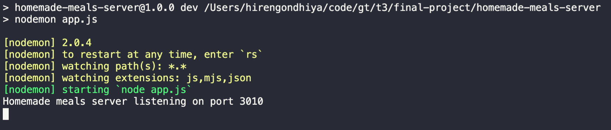
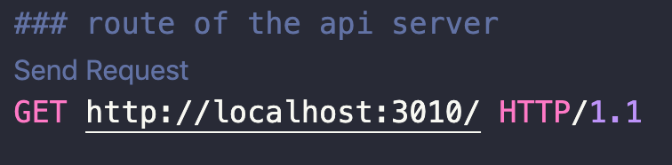
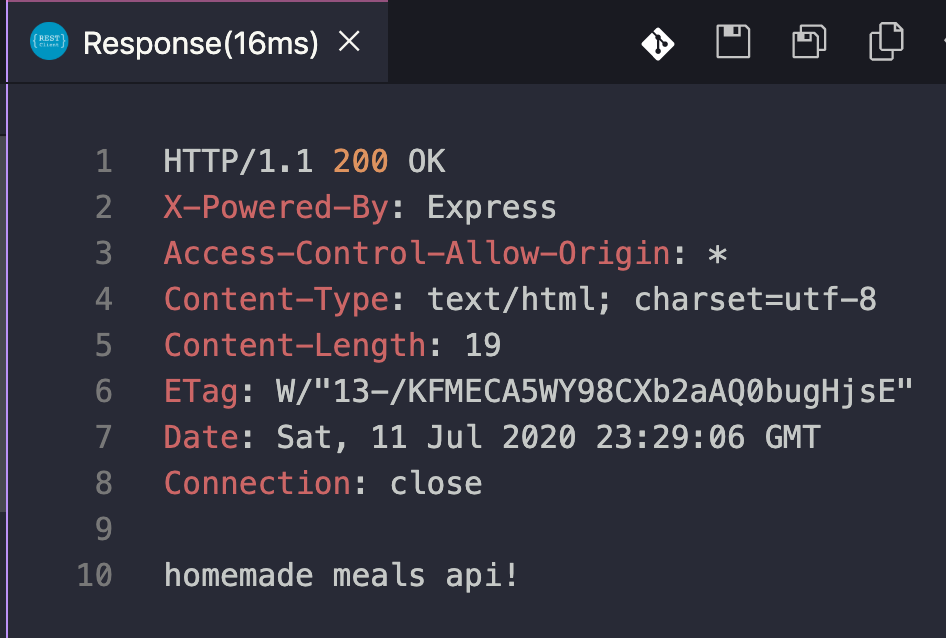

**Table of Contents**

- [Homemade Meals API Server](#homemade-meals-api-server)
  - [Default Port](#default-port)
  - [Run in local environment](#run-in-local-environment)
  - [Testing endpoints locally using REST Client](#testing-endpoints-locally-using-rest-client)
  - [Scripts](#scripts)
    - [Test](#test)
    - [Lint](#lint)
  - [APIs](#apis)
    - [Meal](#meal)

# Homemade Meals API Server

## Default Port

3010

## Run in local environment

In local environment the runs on port 3010.

- Install app dependencies - node packages
  ```
  npm install
  ```
- Run app in dev mode (Auto loaded on file changes)
  ```
  npm run dev
  ```
  You should get following result
  

## Testing endpoints locally using REST Client

- Install REST Client Extension in VS Code
- Run app in dev mode
- Open any of the .http file and clik on send

  For example clicking on send reqest for "route of the api server"
  
  would produce follwing result
  

## Scripts

### Test

To run all the unit test use

```
npm test
```

### Lint

To lint all the files within repository use

```
npm run lint
```

## APIs

### Meal

- GET /meal
- GET /meal/:id
- GET /meal/oftheday
- POST /meal
- PUT /meal/:id
- DELETE /meal/:id
