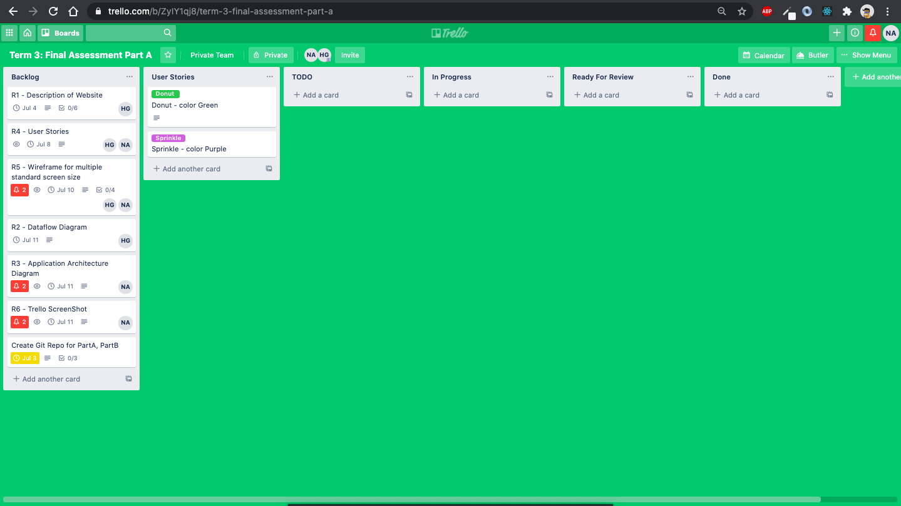
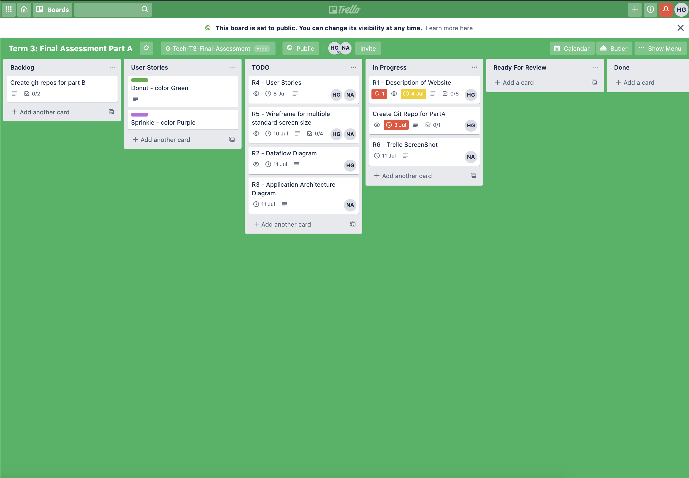

# Homemade Meals

**GitHub Repos**

Client: https://github.com/homemade-meals/client

Server: https://github.com/homemade-meals/server

**Deployed Links**

Client: https://homemade-meals.netlify.app/

Server: https://homemade-meals-server.herokuapp.com/

**Table Of Contents**

- [Homemade Meals](#homemade-meals)
- [1. Description of your website](#1-description-of-your-website)
  - [1.1. Purpose](#11-purpose)
  - [1.2. Functionality / features](#12-functionality--features)
    - [1.2.1. User Management](#121-user-management)
    - [1.2.2. Profile Management](#122-profile-management)
    - [1.2.3. Order Management](#123-order-management)
    - [1.2.4. Menu Management](#124-menu-management)
  - [1.3. Target audience](#13-target-audience)
  - [1.4. Tech stack GENERAL](#14-tech-stackgeneral)
- [2. Dataflow Diagram](#2-dataflow-diagram)
- [3. Application Architecture Diagram](#3-application-architecture-diagram)
- [4. User Stories](#4-user-stories)
- [5. Wireframes](#5-wireframes)
- [6. Project Management](#6-project-management)

# 1. Description of your website

## 1.1. Purpose

**What is this App about?**

This app offers food lovers a platform to order healthy, authentic home-cooked food prepared by people who genuinely care about cooking. It allows people to buy fresh home-cooked food prepared by professional or hobbyist cooks using the best ingredients. It also provides users to choose from a variety of cuisines and home chefs.

**What are the available choices and what’s wrong with them?**

There are currently three options for people to eat: prepare at home, eat at a restaurant, or order takeaway.

Although cooking food at home seems like the best approach, it may not be suitable for everyone, as people may be busy with their work or other responsibilities. So people tend to go with the other two options. The problem with this is that not all restaurants maintain basic quality standards. We are unknown about the quality of food when we order online through apps. This is deteriorating our health and causing different diseases. Food ordered through takeaway delivery is expensive.

**How are we solving this problem?**

We are introducing the fourth way of ordering food i.e ordering home-cooked food from local people and local chefs made at their home. Our dream is to offer home-cooked high-quality food to everyone who loves fresh and nutritious meals but has no time, skill, or resources to prepare one for themselves. You can finally order healthy and authentic home-cooked food prepared by people who are passionate about cooking with our app. Not only is our food healthy and tasty but it is also cheaper compared to restaurants and takeaways, as our chefs don’t need to pay the rent for the restaurant and are preparing food from the comfort of their home.

**How does it work?**

1. Browse through the list of delicious homemade dishes, prepared by our talented home cooks.
2. Choose a home-cooked meal and put an order.
3. Pick up your meal and enjoy fresh, homemade food, and share your experience with us!

## 1.2. Functionality / features

The app provides following functionality and features

### 1.2.1. User Management

User management functionality provides ability to authenticate and authorize various users of the app. The functionality is implemented through following features

- Register
- Login
- Logout

### 1.2.2. Profile Management

Profile management functionality provides ability to the customers of the store to share contact and other related details in order to communicate with the store admins if required. It also provides store admins to publish the store address, and contact details.

The functionality is implemented through following features

- Edit profile
- View customer details
- Edit store details
- View Store details

### 1.2.3. Order Management

Order Management functionality provides customers to make, edit and cancel the orders as well as view order details and history. The functionality can be used by store admins to view orders for the day and the customers who made the orders.

The functionality is implemented through following features

- Create Order
- Edit Order
- Cancel Order
- View Orders Made
- View Orders Received

### 1.2.4. Menu Management

Menu management functionality provides ablity to customers to view the menu of the day. It can be used by Store admins to create the menu of the day.

The functionality is implemented through follow features

- Create menu of the day
- Edit menu of the day
- Delete menu of the day
- View menu of the day

## 1.3. Target audience

We will generally have three targeted audience group:

**College Students and Young Adults:**

This group of people live very fast paced lives. They are busy with their studies, social circles or might be starting a new career. So cooking food at home can be really difficult for them. They will also be missing their home cooked meal when they are living away from home. Our home cooked meal will provide them a taste of their home.

**Parents**

Life of parents with young kids can be very busy. With endless things going around their life, cooking food at the end of the day can be very overwhelming. Buying our home cooked meal will not only give them enough time to spend with their childrens but also, they don’t have to feel guilty of feeding their kids some unhealthy food from restaurants or takeaways.

**Working Professionals**

This group of people are really busy with their work and career. After a long day at work, they don’t like to think about cooking food. So they are more likely to order food from our app, as it gives a healthy option to ordering food from restaurants or takeaways.

Apart from this group, anyone who is passionate about food and would like to taste authentic home-cooked meal would be our target customer.

## 1.4. Tech stack GENERAL

- React.js: For rendering and management of front end of the app.
- JSX: Used in conjunction with React, for describing and structuring UI of the app
- Node.js: Server side run time.
- Express: Web server to serve backend api and frontend of the app.
- MongoDB: Document data storage to persist state of the app for various users.
- Mongoose: Object Data Modeling (ODM) library to help communicate with MongoDB through MongoDB drivers.
- MongoDB Atlas: Cloud based database hosting service for MongoDB.
- Passport.js: Authentication middleware for Node.js to authenticate various users of the app.
- SASS: CSS Preprocessor to help keep CSS stylings of the app organized.
- Bootstrap: Framework to build responsive mobile first UI of the app.
- HTML5: Markup created by React to structure and represent UI of the app to the browser.
- CSS: To describe how to style various HTML elements on the screen.
- JavaScript: Used both at server side and client side the program application logic.
- Netlify: To host frontend of the app so that it can be accessed by various users of the app over internet.
- Heroku: To host backend api of the app so that it can be accessed by app over the internet.
- Mocha: JavaScript based test framework running on Node.js used to run Unit tests.
- Expect: Assertion library used to verify outcome of unit tests.
- Cypress: JavaScript based End to End testing framework.
- GitHub: To host source code of the app for collaboration and source management using Git.
- Git: Used for source code management.

# 2. Dataflow Diagram

Above diagram depicts various processes, external entities, data stores and the flow of information among them.

The System works as follows,

1. Register
   Customer entity initiates 1.0 Register Process by providing Userid, Email and Password details. Register process verifies the details and passes on the User details to User store for storage.
2. Login
   1. Customer Entity initiates 2.0 Login Process by providing Customer Credentials. Login process retrieves User data from Users store and verifies the credentials and stores Login session into Users store.
   2. Store admin Entitity initiates 2.0 Login Process by providing Store Admin Credentials. Login process retrieves User data from Users store and verifies the credentials and stores Login session into Users store.
3. Create Menu Item
   Store Admin intiates 3.0 Create Menu Item Process by filling in Create Meal form. The process verifies the Authenticated user is Authorized Store Admin and then stores the menu item into Menu Items Data store.
4. Order Meal
   Customer entitity initiates Order 4.1 process by providing Order Details. The process checks the user is Authenticated and Verifies the meal availability from Verify Availability process, updates item availability through Update Availability process, stores Customer Order in Orders store and send Order Confirmation to the Customer Entity.
5. Order Pickup
   Customer entity initiates Order Pickup by provide Order Id, the process verifies the Order throgh Verifiy Order process, marks the order as picked up in Orders store, and then Customer picks up the meal.

# 3. Application Architecture Diagram

# 4. User Stories

There are two main users that will interact with our app. They are the store owner who will be selling the food and the customers who will be buying the food through the app. So the user stories are created thinking about how they would interact with the app and what necessary features and functions are necessary for the smooth operation of the app.

**Store Admin User Stories**

1. As a store admin, I want to register my store, so that I can sell the food through the app.
2. As a store admin, I want to login to my account, so that I can update my profile, upload images of my food, create a menu of the day, check the quantity ordered for the day or delete the items.
3. As a store admin, I want to logout from my account, so that no one can have access to my account.
4. As a store admin, I want to create a menu of the day, so that customers can see what foods are available to order on that particular day.
5. As a store admin, I want to upload images of my food, so that my customers can see images of food that they would like to order.
6. As a store admin, I want to check what order has come through for the day, so that I will know in advance what food needs to be cooked and to what quantity.
7. As a store admin, I want to edit the menu of the day, so that I can make necessary changes in the menu.
8. As a store admin, I want to delete the menu of the day, so that I can remove anything that I don’t want to be seen on the website.
9. As a store admin, I want to mark all the orders that have been picked by the customer, so that no customer will falsely claim the order, after the order has already been picked.
10. As a store admin, I want to edit my profile, so that I can make changes to my details if anything changes in the future.
11. As a store admin, I want to see my customer details, so that I can confirm their identity when they come to pick up the food.

**Customer User Stories**

1. As a customer, I want to register my account, so that I can use the same username and password everytime I login to my account.
2. As a customer, I want to login into my account, so that I can create, edit, and delete my order.
3. As a customer, I want to logout from my account, so that no one can access my account.
4. As a customer, I want to create order, so that I can order the food through the store.
5. As a customer, I want to edit orders, so that I can make changes to what I ordered.
6. As a customer, I want to cancel my order, so that I don’t have to pay for what I don’t want to order.
7. As a customer, I want to view the orders that I made, so that I can reconfirm all the details and orders that I made.
8. As a customer, I want to view my order history, so that I know what foods I have been ordering in the past and how much I have been paying.
9. As a customer, I want to create my profile page, so that I don’t have to update my details everytime I order my food.
10. As a customer, I want to get order confirmation, so that I can be sure that order has gone through and in case I don’t receive my order I have proof of purchase.

# 5. Wireframes

1. **Customer Views**
   1. **Home**
      1. **Signed Out**
         .png>)
      2. **Signed In**
         .png>)
   2. **Register**
      
   3. **About us**
      
   4. **My Profile**
      
   5. **Order Meal - form**
      
   6. **Order Confirmation / View Order**
      
   7. **Order History**
      
2. **Store Admin Views**
   1. **Home**
      .png>)
   2. **About us**
      
   3. **Edit About us - form**
      
   4. **Create/Edit Meal - form**
      
   5. **View Meal Details**
      
   6. **Meals list**
      
3. **Common**
   1. **Login**
      

# 6. Project Management

The project will be developed using agile methodology. There are total four sprints planned, each of them being one week in duration. The first sprint is dedicated to inception, planning, and documentation. Remaining three sprints are dedicated to build in that one by one all the planned features of the project will be developed and deployed.

Trello board is used for planning and tracking of various tasks. The Trello board used for planning and project management can be found [here](https://trello.com/b/ZyIY1qj8/homemade-meals)

Below screen prints shows state of tasks in various stages of the project.

1 **Trello Image (03-07-2020)**

2

3

4

5

6

7

8

9

10

11

12

